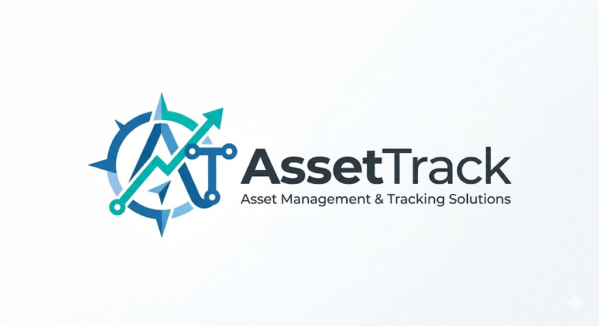
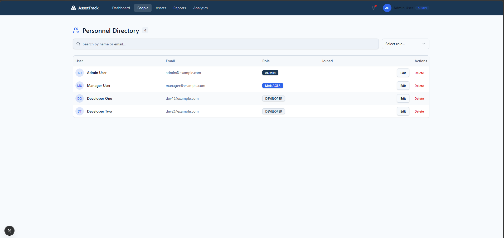
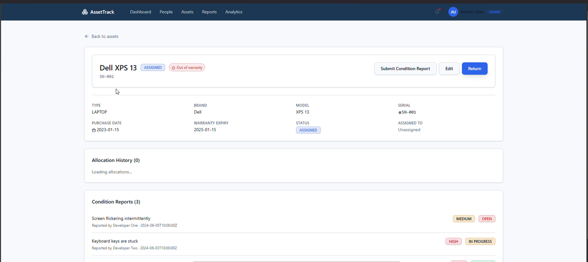

# AssetFlow — Enterprise Asset Management System



AssetFlow is a modern, web-based enterprise asset management platform designed for seamless tracking, allocation, and lifecycle management of IT hardware. \
Manage users, track equipment, report issues, and generate comprehensive analytics—all with role-based access control and real-time updates.

[](#)
[](#)
[](#)


## Screenshot Gallery

### Dashboard Overview

The main workspace provides at-a-glance visibility into critical asset metrics, with quick-access navigation to all core features.


---

### Asset Inventory Management

Complete visibility over all hardware assets with rich categorization and status tracking.

- **Asset Types:** Laptops, Monitors, Accessories—each with detailed specifications.
- **Status Tracking:** AVAILABLE, ASSIGNED, UNDER_REPAIR, DECOMMISSIONED.
- **Warranty Monitoring:** Track expiration dates and receive automated alerts.  
   

### Personnel & Role Management

Centralized user directory with granular role-based access control (RBAC).

- **User Roles:** ADMIN, MANAGER, DEVELOPER—each with tailored permissions.
- **Profile Management:** View and edit team member information.
- **Role Assignment:** Promote or restrict access with a single action.  
   

### Core Features & Workflows

Powerful capabilities designed to streamline asset operations and provide actionable intelligence.

---

#### Asset Allocation & Assignment

Seamless workflow for deploying equipment to team members and tracking usage history.

- **One-Click Assignment**  
  Assign any available asset to a user with automatic status updates.

- **Return & Redeployment**  
  Mark assets as returned and immediately redeploy to the next user.

- **Allocation History**  
  View complete assignment history with timestamps for audit compliance.



> **tip:** Use allocation history to identify high-utilization assets and plan procurement accordingly.

---

#### Condition Reporting System

Empower users to report hardware issues and enable managers to track resolution progress.

- **Developer Reporting**  
  Team members submit issues on assigned equipment with severity levels (LOW, MEDIUM, HIGH).

- **Status Workflow**  
  Reports flow through OPEN → IN_PROGRESS → RESOLVED states with manager oversight.

- **Resolution Tracking**  
  Document fixes and solutions for future reference.


> **tip:** High-frequency reports on specific assets may indicate vendor quality issues or procurement patterns.

---

#### Analytics & Insights

Data-driven dashboards for strategic decision-making and operational planning.

- **Asset Utilization**  
  Track allocation rates, average deployment duration, and user equipment counts.

- **Warranty Expiry Planning**  
  Identify upcoming warranty expirations and recommend maintenance or replacement actions.

- **Condition Report Analytics**  
  Monitor issue frequency, resolution time, and asset health trends.


> **tip:** Use warranty expiry data to negotiate bulk renewal deals and plan budget cycles.

---

#### Role-Based Access Control

Granular permissions ensure data security and workflow integrity.

- **Admin:** Full system access, user management, and role assignment.
- **Manager:** Asset operations, report management, and analytics access.
- **Developer:** Personal asset tracking and issue reporting.

> **Pro tip:** Managers can audit asset allocation history without exposing sensitive corporate data to all team members.

---

#### Real-Time Notifications

Stay informed of critical events with intelligent alert routing.

- **Warranty Expiry Alerts**  
  Proactive notifications for assets approaching warranty end.

- **Assignment Updates**  
  Track when equipment is allocated or returned.

- **Report Status Changes**  
  Follow condition reports from submission to resolution.

> **tip:** Configure notification preferences to focus on alerts most relevant to your role.

---

#### Search & Filter

Powerful discovery tools for finding assets and users in seconds.

- **Asset Search**  
  Query by brand, model, serial number, or allocation status.

- **User Directory**  
  Filter by role, department, or equipment assignment status.

- **Report Filtering**  
  Narrow condition reports by status, severity, or assigned asset.

> **tip:** Save common filter combinations as quick views for recurring workflows.

---

---

# Table of Contents

- [Installation](#installation)
- [Quick Start](#quick-start)
- [Features](#features)
- [Development & Contributing](#development--contributing)
- [Contact & Acknowledgements](#contact--acknowledgements)

---

# Installation

## Prerequisites

- **Node.js** (v16+ recommended)
- **npm** (bundled with Node.js)

---

## Setup

Install project dependencies from the root directory:

```powershell
cd "AssetFlow"
npm install
```

## Quick Start

1. Open the app in your browser.

2. Log in with your assigned role (ADMIN, MANAGER, or DEVELOPER).

3. From the Dashboard, you get an overview of:

   - Total assets and their current statuses
   - Active allocations and recent returns
   - Pending condition reports

4. Navigate to:

   - **Assets** to browse inventory, check warranty dates, and manage hardware.
   - **People** to view the user directory and manage role assignments.
   - **Allocation** to assign equipment or process returns.
   - **Reports** to submit or track condition reports.
   - **Analytics** to review utilization trends and warranty planning data.

5. Use **Search & Filter** across any section to find what you need fast.

**tip:**  
Start by setting up your user roles under People before doing any asset assignments — permissions determine what each team member can see and do across the platform.